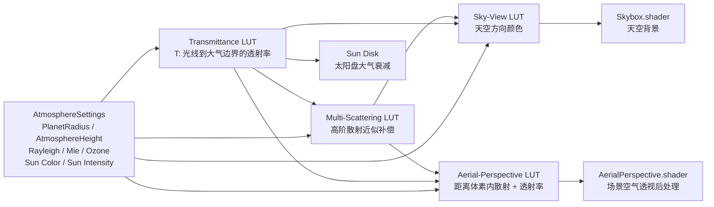

# Unity URP 实时大气散射渲染技术解析

## 摘要

本文针对当前 Unity 2022 / URP 大气散射项目，分析其以查找表为核心的实时大气渲染方案。系统通过 `AtmosphereRenderFeature` 在 URP 渲染流水线中预计算 Transmittance LUT、Multi-Scattering LUT、Sky-View LUT 与 Aerial-Perspective LUT，再由自定义 Skybox Shader 和屏幕后处理 `AerialPerspectiveRenderFeature` 完成天空背景、太阳盘和场景空气透视合成。

该实现采用球形星球大气模型，将 Rayleigh 散射、Mie 散射、Mie 吸收和 Ozone 吸收编码为高度相关介质系数，并使用 ray marching 数值积分近似 Beer-Lambert 透射率与沿视线内散射。为了满足实时渲染需求，昂贵的积分被拆分到低分辨率 LUT 中，每帧按主光方向和相机高度更新，然后在天空盒和后处理阶段进行快速采样。

**关键词：** Unity URP；实时大气散射；Rayleigh 散射；Mie 散射；Transmittance LUT；Sky View LUT；Aerial Perspective；ScriptableRendererFeature

## 1. 项目结构与研究对象

当前目录中的大气系统由三层组成：

| 层级 | 文件 | 作用 |
|---|---|---|
| 参数层 | `AtmosphereSettings.cs`、`Atmosphere.asset` | 保存海平面、星球半径、大气高度、太阳强度、Rayleigh/Mie/Ozone 参数 |
| URP 管线层 | `AtmosphereRenderFeature.cs` | 生成并绑定四张全局 LUT |
| 后处理管线层 | `AerialPerspectiveRenderFeature.cs` | 基于深度纹理，把空气透视合成回相机颜色 |
| HLSL 物理层 | `Shader/Scattering.hlsl`、`Shader/Raymarching.hlsl`、`Shader/Helper.hlsl` | 实现散射系数、相函数、射线求交、透射率与内散射积分 |
| 表生成 Shader | `TransmittanceLut.shader`、`MultiScatteringLut.shader`、`SkyViewLut.shader`、`AerialPerspectiveLut.shader` | 将物理积分结果写入 LUT |
| 显示 Shader | `Skybox.shader`、`AerialPerspective.shader` | 采样 LUT 输出天空背景和空气透视 |

其中，`大气散射_Renderer.asset` 已挂载两个 Renderer Feature：

1. `AtmosphereRenderFeature`，执行时机为 `BeforeRenderingSkybox`。
2. `AerialPerspectiveRenderFeature`，执行时机为 `BeforeRenderingPostProcessing`。

## 2. 渲染流水线总览

本项目的核心思想是：不要在每个屏幕像素中完整求解大气散射，而是将可复用的积分结果预计算到 LUT 中。

### 2.1 渲染流水线流程图

```mermaid
flowchart TD
    A[URP Camera Begin] --> B[AtmosphereRenderFeature<br/>BeforeRenderingSkybox]

    B --> B1[SetGlobalAtmosphereParameters<br/>上传 AtmosphereSettings]
    B1 --> B2[EnsureRenderTextures<br/>创建/复用 LUT RenderTexture]
    B2 --> C[TransmittanceLut.shader<br/>生成 _transmittanceLut]
    C --> D[MultiScatteringLut.shader<br/>采样 Transmittance LUT<br/>生成 _multiScatteringLut]
    D --> E[SkyViewLut.shader<br/>采样 Transmittance + MultiScattering<br/>生成 _skyViewLut]
    E --> F[AerialPerspectiveLut.shader<br/>采样 Transmittance + MultiScattering<br/>生成 _aerialPerspectiveLut]
    F --> G[SetGlobalLutTextures<br/>绑定全局 LUT]

    G --> H[URP Draw Skybox]
    H --> H1[CasualAtmosphere/Skybox<br/>采样 _skyViewLut]
    H1 --> H2[GetSunDisk<br/>采样 _transmittanceLut<br/>叠加太阳盘]

    H2 --> I[URP Draw Opaque Objects]
    I --> J[URP Draw Transparent Objects]
    J --> K[AerialPerspectiveRenderFeature<br/>BeforeRenderingPostProcessing]

    K --> K1[Blitter 复制 CameraColor 到临时 RT]
    K1 --> K2[AerialPerspective.shader<br/>读取 _BlitTexture + _CameraDepthTexture]
    K2 --> K3[重建 World Position<br/>计算相机到物体距离]
    K3 --> K4[采样 _aerialPerspectiveLut<br/>按距离 slice 插值]
    K4 --> K5[sceneColor * transmittance + inScattering]
    K5 --> K6[写回 CameraColor]

    K6 --> L[URP Post Processing]
    L --> M[Final Frame]
```



### 2.2 LUT 生成依赖图



完整渲染顺序如下：

```text
URP Camera Render
    |
    |-- AtmosphereRenderFeature
    |       1. 设置全局大气参数
    |       2. 生成 Transmittance LUT
    |       3. 生成 Multi-Scattering LUT
    |       4. 生成 Sky-View LUT
    |       5. 生成 Aerial-Perspective LUT
    |       6. 设置全局纹理
    |
    |-- Draw Skybox
    |       采样 Sky-View LUT + Transmittance LUT
    |       输出天空颜色和太阳盘
    |
    |-- Draw Opaque / Transparent Scene
    |
    |-- AerialPerspectiveRenderFeature
    |       1. 读取相机颜色
    |       2. 读取相机深度
    |       3. 按屏幕 UV 和距离采样 Aerial-Perspective LUT
    |       4. sceneColor * transmittance + inScattering
    |
    |-- URP Post Processing
```

`AtmosphereRenderFeature` 的主执行逻辑位于 `Execute()`：

```csharp
SetGlobalAtmosphereParameters(cmd);
SetGlobalLutTextures(cmd);

cmd.Blit(null, m_TransmittanceLut, m_TransmittanceLutMaterial);
cmd.Blit(null, m_MultiScatteringLut, m_MultiScatteringLutMaterial);
cmd.Blit(null, m_SkyViewLut, m_SkyViewLutMaterial);
cmd.Blit(null, m_AerialPerspectiveLut, m_AerialPerspectiveLutMaterial);

SetGlobalLutTextures(cmd);
```

这段顺序不可任意打乱，因为依赖关系是单向的：

```text
Transmittance LUT
    -> Multi-Scattering LUT
    -> Sky-View LUT
    -> Aerial-Perspective LUT
```

## 3. 物理模型

### 3.1 球形大气模型

项目把星球视为半径为 `PlanetRadius` 的球体，大气为外半径：

```text
R_top = PlanetRadius + AtmosphereHeight
```

在 Shader 中，相机并不使用完整世界坐标参与球面计算，而是只取世界高度：

```hlsl
float h = _WorldSpaceCameraPos.y - param.SeaLevel + param.PlanetRadius;
float3 eyePos = float3(0, h, 0);
```

这样做利用了球形大气的旋转对称性。只要相机高度、观察方向和太阳方向确定，水平位置可以被旋转归一化，不影响散射计算。

### 3.2 介质系数

大气介质被拆成散射和吸收两部分：

```text
sigma_t = sigma_s + sigma_a
```

其中：

```text
sigma_s = RayleighCoefficient + MieCoefficient
sigma_a = OzoneAbsorption + MieAbsorption
```

`Shader/Scattering.hlsl` 中的 Rayleigh 散射系数：

```hlsl
float3 RayleighCoefficient(in AtmosphereParameter param, float h)
{
    h = max(h, 0.0);
    const float3 sigma = float3(5.802, 13.558, 33.1) * 1e-6;
    float H_R = param.RayleighScatteringScalarHeight;
    float rho_h = exp(-(h / H_R));
    return sigma * rho_h * param.RayleighScatteringScale;
}
```

该项随高度指数衰减，且蓝色通道最大，因此天空呈现蓝色。

Mie 散射用于描述气溶胶、水汽和尘埃：

```hlsl
float3 MieCoefficient(in AtmosphereParameter param, float h)
{
    h = max(h, 0.0);
    const float3 sigma = (3.996 * 1e-6).xxx;
    float H_M = param.MieScatteringScalarHeight;
    float rho_h = exp(-(h / H_M));
    return sigma * rho_h * param.MieScatteringScale;
}
```

Mie 标高通常远小于 Rayleigh 标高，因此雾感和地平线泛白主要集中在低空。

Ozone 吸收采用三角形高度分布：

```hlsl
float3 OzoneAbsorption(in AtmosphereParameter param, float h)
{
    h = max(h, 0.0);
    #define sigma_lambda (float3(0.650f, 1.881f, 0.085f)) * 1e-6

    float center = param.OzoneLevelCenterHeight;
    float width = param.OzoneLevelWidth;
    float rho = max(0, 1.0 - (abs(h - center) / width));

    return sigma_lambda * rho * param.OzoneAbsorptionScale;
}
```

该项主要影响高空与日出日落色彩。

### 3.3 相函数

Rayleigh 相函数：

```text
P_R(cos theta) = 3 / (16 pi) * (1 + cos^2 theta)
```

Mie 相函数使用近似 Henyey-Greenstein / Cornette-Shanks 风格公式，参数 `MieAnisotropy` 控制前向散射强度：

```hlsl
float MiePhase(in AtmosphereParameter param, float cos_theta)
{
    float g = param.MieAnisotropy;
    float a = 3.0 / (8.0 * PI);
    float b = (1.0 - g*g) / (2.0 + g*g);
    float c = 1.0 + cos_theta*cos_theta;
    float d = pow(1.0 + g*g - 2*g*cos_theta, 1.5);
    return a * b * (c / d);
}
```

最终单次散射源项为：

```hlsl
float3 Scattering(in AtmosphereParameter param, float3 p, float3 lightDir, float3 viewDir)
{
    float cos_theta = dot(lightDir, viewDir);
    float h = length(p) - param.PlanetRadius;

    float3 rayleigh = RayleighCoefficient(param, h) * RayleiPhase(param, cos_theta);
    float3 mie = MieCoefficient(param, h) * MiePhase(param, cos_theta);

    return rayleigh + mie;
}
```

## 4. 透射率计算

透射率使用 Beer-Lambert 定律：

```text
T(p1, p2) = exp(- integral(sigma_t ds))
```

项目中 `Raymarching.hlsl` 的 `Transmittance()` 使用 32 步 midpoint rule：

```hlsl
float3 Transmittance(in AtmosphereParameter param, float3 p1, float3 p2)
{
    const int N_SAMPLE = 32;
    float3 delta = p2 - p1;
    float distance = length(delta);

    if(distance <= 0.001)
        return 1.0.xxx;

    float3 dir = delta / distance;
    float ds = distance / float(N_SAMPLE);
    float3 sum = 0.0;
    float3 p = p1 + (dir * ds) * 0.5;

    for(int i=0; i<N_SAMPLE; i++)
    {
        float h = length(p) - param.PlanetRadius;

        float3 scattering = RayleighCoefficient(param, h) + MieCoefficient(param, h);
        float3 absorption = OzoneAbsorption(param, h) + MieAbsorption(param, h);
        float3 extinction = scattering + absorption;

        sum += extinction * ds;
        p += dir * ds;
    }

    return exp(-sum);
}
```

为了避免运行时在每个像素重复积分，系统先生成 Transmittance LUT。

## 5. Transmittance LUT

`TransmittanceLut.shader` 将二维 UV 映射为物理参数：

- `r`：采样点到星球中心的距离。
- `mu`：视线方向和局部竖直方向夹角的余弦。

坐标映射位于 `Helper.hlsl`：

```hlsl
void UvToTransmittanceLutParams(
    float bottomRadius,
    float topRadius,
    float2 uv,
    out float mu,
    out float r)
```

LUT 每个 texel 执行：

```hlsl
float3 eyePos = float3(0, r, 0);
float3 viewDir = float3(sin_theta, cos_theta, 0);
float dis = RayIntersectSphere(
    float3(0,0,0),
    param.PlanetRadius + param.AtmosphereHeight,
    eyePos,
    viewDir
);

float3 hitPoint = eyePos + viewDir * dis;
color.rgb = Transmittance(param, eyePos, hitPoint);
```

这张表回答的问题是：

```text
从任意高度 r 沿任意角度 mu 走到大气顶部，光还剩多少？
```

后续所有太阳光入射衰减都可以查这张表。

## 6. 多重散射 LUT

单次散射只考虑太阳光被散射一次后进入相机。真实天空中还有多次散射，会让阴影侧天空更亮、低空更柔和。本项目使用 `MultiScatteringLut.shader` 预计算一个近似补偿项。

核心函数为：

```hlsl
float3 IntegralMultiScattering(
    in AtmosphereParameter param,
    float3 samplePoint,
    float3 lightDir,
    Texture2D _transmittanceLut,
    SamplerState samplerLinearClamp)
```

算法步骤：

1. 在采样点周围选取 64 个球面方向。
2. 每个方向 ray marching 32 步。
3. 对每个采样点计算太阳透射率、局部单次散射、回到原采样点的透射率。
4. 累积二次散射源项 `G_2`。
5. 累积散射反馈项 `f_ms`。
6. 用几何级数近似全部高阶散射：

```text
G_ALL = G_2 / (1 - f_ms)
```

代码核心：

```hlsl
G_2  += t1 * s * t2 * uniform_phase * ds;
f_ms += t2 * sigma_s * uniform_phase * ds;

G_2 *= sphereSolidAngle;
f_ms *= sphereSolidAngle;

return G_2 * (1.0 / (1.0 - f_ms));
```

最终 `GetMultiScattering()` 通过高度和太阳天顶角采样该 LUT：

```hlsl
float3 GetMultiScattering(
    in AtmosphereParameter param,
    float3 p,
    float3 lightDir,
    Texture2D lut,
    SamplerState spl)
{
    float h = length(p) - param.PlanetRadius;
    float3 sigma_s = RayleighCoefficient(param, h) + MieCoefficient(param, h);
    float cosSunZenithAngle = dot(normalize(p), lightDir);
    float2 uv = float2(cosSunZenithAngle * 0.5 + 0.5, h / param.AtmosphereHeight);
    float3 G_ALL = lut.SampleLevel(spl, uv, 0).rgb;
    return G_ALL * sigma_s;
}
```

## 7. Sky-View LUT

Sky-View LUT 负责预计算从相机向天空任意方向看去的天空颜色。它使用二维 UV 表示球面方向：

```hlsl
float3 viewDir = UVToViewDir(uv);
```

再通过主光源方向、相机高度和 LUT 输入调用 `GetSkyView()`：

```hlsl
color.rgb = GetSkyView(
    param,
    eyePos,
    viewDir,
    lightDir,
    -1.0f,
    _transmittanceLut,
    _multiScatteringLut,
    sampler_LinearClamp
);
```

`GetSkyView()` 的积分模型为：

```text
L = integral[
    T_sun(p) *
    scattering(p, lightDir, viewDir) *
    T_view(p) *
    sunLuminance
] ds
+
integral[
    multiScattering(p) *
    T_view(p) *
    sunLuminance
] ds
```

代码片段：

```hlsl
float3 t1 = TransmittanceToAtmosphere(param, p, lightDir, _transmittanceLut, samplerLinearClamp);
float3 s  = Scattering(param, p, lightDir, viewDir);
float3 t2 = exp(-opticalDepth);

float3 inScattering = t1 * s * t2 * ds * sunLuminance;
color += inScattering;

float3 multiScattering = GetMultiScattering(param, p, lightDir, _multiScatteringLut, samplerLinearClamp);
color += multiScattering * t2 * ds * sunLuminance;
```

这张 LUT 最终被 `Skybox.shader` 采样：

```hlsl
color.rgb += _skyViewLut.SampleLevel(
    sampler_LinearClamp,
    ViewDirToUV(viewDir),
    0
).rgb;
```

## 8. 天空盒与太阳盘

`Skybox.shader` 使用当前天空方向查询 `_skyViewLut`，再叠加太阳盘：

```hlsl
float3 viewDir = normalize(i.worldPos - _WorldSpaceCameraPos.xyz);
Light mainLight = GetMainLight();
float3 lightDir = -mainLight.direction;

color.rgb += _skyViewLut.SampleLevel(sampler_LinearClamp, ViewDirToUV(viewDir), 0).rgb;
color.rgb += GetSunDisk(param, eyePos, viewDir, lightDir);
```

太阳盘函数首先判断视线是否接近太阳方向：

```hlsl
float cosine_theta = dot(viewDir, -lightDir);
float theta = acos(cosine_theta) * (180.0 / PI);
```

然后检查是否被星球遮挡，并用 Transmittance LUT 对太阳亮度进行大气衰减：

```hlsl
sunLuminance *= TransmittanceToAtmosphere(
    param,
    eyePos,
    viewDir,
    _transmittanceLut,
    sampler_LinearClamp
);

if(theta < param.SunDiskAngle)
    return sunLuminance;
```

因此，天空效果是否可见取决于两点：

1. `AtmosphereRenderFeature` 是否生成了 `_skyViewLut`。
2. 场景 `RenderSettings.m_SkyboxMaterial` 是否使用 `CasualAtmosphere_Skybox.mat`。

## 9. Aerial-Perspective LUT

空气透视用于处理场景物体随距离变蓝、变灰、被大气散射覆盖的效果。当前项目把 Aerial Perspective 体素 LUT 打包为二维 atlas：

```text
width  = sliceWidth * sliceCount
height = sliceHeight
```

`AtmosphereRenderFeature` 中设置体素尺寸：

```csharp
cmd.SetGlobalVector(
    AerialPerspectiveVoxelSizeId,
    new Vector4(
        m_Settings.aerialPerspectiveSliceWidth,
        m_Settings.aerialPerspectiveSliceHeight,
        m_Settings.aerialPerspectiveSliceCount,
        0.0f
    )
);
```

`AerialPerspectiveLut.shader` 每个 texel 对应：

- 屏幕方向 `uv.xy`
- 距离 slice `uv.z`

它调用 `GetSkyView()`，但传入 `maxDis` 限制积分距离：

```hlsl
float maxDis = uv.z * _AerialPerspectiveDistance;

color.rgb = GetSkyView(
    param,
    eyePos,
    viewDir,
    lightDir,
    maxDis,
    _transmittanceLut,
    _multiScatteringLut,
    sampler_aerialLutLinearClamp
);
```

RGB 存储沿视线累计的内散射 `inScattering`，Alpha 存储相机到该距离的透射率：

```hlsl
float3 voxelPos = eyePos + viewDir * segmentDistance;
float3 t = segmentDistance > 0.001
    ? Transmittance(param, eyePos, voxelPos)
    : 1.0.xxx;

color.a = dot(t, float3(1.0 / 3.0, 1.0 / 3.0, 1.0 / 3.0));
```

Alpha 采用 RGB 透射率平均值，会丢失部分波长差异，但能节省存储并简化合成。

## 10. 屏幕后处理合成

`AerialPerspectiveRenderFeature` 在 `BeforeRenderingPostProcessing` 阶段执行：

```csharp
Blitter.BlitCameraTexture(
    cmd,
    m_Source,
    m_TempColorTexture,
    m_Material,
    0
);

Blitter.BlitCameraTexture(
    cmd,
    m_TempColorTexture,
    m_Source
);
```

`AerialPerspective.shader` 通过 URP Blitter 提供的 `_BlitTexture` 读取当前相机颜色：

```hlsl
#include "Packages/com.unity.render-pipelines.core/Runtime/Utilities/Blit.hlsl"

float4 frag (Varyings i) : SV_Target
{
    UNITY_SETUP_STEREO_EYE_INDEX_POST_VERTEX(i);
    float2 uv = i.texcoord.xy;
    float3 sceneColor = SAMPLE_TEXTURE2D_X_LOD(_BlitTexture, sampler_LinearClamp, uv, 0).rgb;
    ...
}
```

它读取 `_CameraDepthTexture` 重建世界坐标：

```hlsl
float sceneRawDepth = SAMPLE_DEPTH_TEXTURE(_CameraDepthTexture, my_point_clamp_sampler, screenPos);
float4 ndc = float4(screenPos.x * 2 - 1, screenPos.y * 2 - 1, sceneRawDepth, 1);
float4 worldPos = mul(UNITY_MATRIX_I_VP, ndc);
worldPos /= worldPos.w;
```

然后根据场景距离决定采样哪个 Aerial-Perspective slice：

```hlsl
float dis = length(worldPos - eyePos);
float dis01 = saturate(dis / _AerialPerspectiveDistance);
float sliceCount = max(_AerialPerspectiveVoxelSize.z, 1.0);
float dis0Z = dis01 * (sliceCount - 1.0);

float slice = floor(dis0Z);
float nextSlice = min(slice + 1.0, sliceCount - 1.0);
float lerpFactor = dis0Z - floor(dis0Z);

uv.x /= sliceCount;
float2 uv1 = float2(uv.x + slice / sliceCount, uv.y);
float2 uv2 = float2(uv.x + nextSlice / sliceCount, uv.y);

float4 data = lerp(
    _aerialPerspectiveLut.SampleLevel(sampler_aerialLinearClamp, uv1, 0),
    _aerialPerspectiveLut.SampleLevel(sampler_aerialLinearClamp, uv2, 0),
    lerpFactor
);
```

最终合成公式：

```hlsl
float3 inScattering = data.xyz;
float transmittance = saturate(data.w);

return float4(sceneColor * transmittance + inScattering, 1.0);
```

这就是体积空气透视的经典形式：

```text
L_final = L_scene * T_view + L_inscattering
```

## 11. 关键实现细节与稳定性

### 11.1 射线球求交

大气积分依赖射线与星球、大气外壳求交。项目当前使用：

```hlsl
float RayIntersectSphere(float3 center, float radius, float3 rayStart, float3 rayDir)
{
    float3 centerToRayStart = center - rayStart;
    float OS2 = dot(centerToRayStart, centerToRayStart);
    float SH = dot(centerToRayStart, rayDir);

    float OH2 = max(0.0, OS2 - SH * SH);
    float radius2 = radius * radius;

    if(OH2 > radius2) return -1;

    float PH = sqrt(max(0.0, radius2 - OH2));
    float t1 = SH - PH;
    float t2 = SH + PH;
    float t = (t1 < 0) ? t2 : t1;
    return t;
}
```

这里必须先判断是否命中，再开平方；否则 miss sphere 时会产生 NaN，并污染后续 LUT。

### 11.2 LUT 未就绪保护

后处理阶段如果 `_aerialPerspectiveLut` 尚未被正确生成，直接使用黑色 LUT 会导致整屏变黑。当前后处理加入了保护：

```hlsl
if (_AerialPerspectiveDistance <= 0.0 || _AerialPerspectiveVoxelSize.z <= 1.0)
    return float4(sceneColor, 1.0);

if (data.w <= 0.0001 && dot(abs(inScattering), 1.0.xxx) <= 0.0001)
    return float4(sceneColor, 1.0);
```

这使得 LUT 尚不可用时不会破坏原场景颜色。

### 11.3 Renderer Feature 序列化

`AerialPerspectiveRenderFeature` 使用 `FeatureSettings` 统一保存材质和插入时机：

```csharp
[Serializable]
public class FeatureSettings
{
    public Material aerialPerspectiveMaterial;
    public RenderPassEvent renderPassEvent = RenderPassEvent.BeforeRenderingPostProcessing;
}
```

这样与 `大气散射_Renderer.asset` 中的序列化结构一致：

```yaml
settings:
  aerialPerspectiveMaterial: {fileID: 2100000, guid: b04959ea21d42db4aace1af36b0d45fd, type: 2}
  renderPassEvent: 550
```

## 12. 性能分析

该方案的主要 GPU 成本来自 LUT 生成：

| LUT | 默认尺寸 | 每 texel 成本 | 用途 |
|---|---:|---|---|
| Transmittance | 256 x 64 | 32 步积分 | 光路透射率 |
| Multi-Scattering | 32 x 32 | 64 方向 x 32 步 | 高阶散射补偿 |
| Sky-View | 256 x 128 | 32 步积分 + LUT 采样 | 天空背景 |
| Aerial-Perspective | 1024 x 32 | 32 步积分 + LUT 采样 | 场景空气透视 |

其中 Multi-Scattering LUT 理论成本最高，但分辨率较低。Aerial-Perspective LUT 被打包成 `32 * 32 = 1024` 宽、`32` 高的 2D atlas，后处理采样成本较低，只做两次 slice 采样和一次线性插值。

若需要优化，可考虑：

1. Transmittance LUT 只在参数或太阳方向变化时更新。
2. Multi-Scattering LUT 可降低更新频率。
3. Aerial-Perspective LUT 可按相机移动阈值更新。
4. 使用 Compute Shader 替代 `cmd.Blit` 生成 LUT，改善线程组织和 3D atlas 写入。

## 13. 当前实现的限制

1. 相机水平位置被忽略，只使用高度，适合星球尺度天空，但不适合局部非均匀天气。
2. Aerial-Perspective Alpha 使用 RGB 透射率平均，会丢失彩色消光。
3. 多重散射是近似补偿，不是完整高阶散射求解。
4. Sky-View LUT 当前按相机高度和主光方向每帧生成，静态情况下存在可缓存空间。
5. Mie 相函数在 `g` 接近 1 时可能出现非常强的峰值，应限制 `MieAnisotropy` 在合理范围。
6. 当前大气模型不包含地面反照率对天空的二次贡献。

## 14. 结论

当前项目实现了一个完整的 URP 实时大气散射框架。其关键贡献在于把大气散射积分拆解为多张低维 LUT：

```text
Transmittance LUT        -> 解决光线穿过大气的衰减
Multi-Scattering LUT     -> 近似高阶散射能量
Sky-View LUT             -> 生成天空背景颜色
Aerial-Perspective LUT   -> 生成场景物体距离雾化与内散射
```

在渲染阶段，天空盒只需采样 Sky-View LUT，场景空气透视只需基于深度采样 Aerial-Perspective LUT 并执行：

```text
finalColor = sceneColor * transmittance + inScattering
```

这使得复杂的大气散射计算能够在 URP 实时管线中运行，并保持较清晰的模块划分：C# 负责资源生命周期和渲染事件调度，HLSL 负责物理模型和数值积分，材质与 Renderer asset 负责把二者连接到 Unity 渲染管线。

## 参考实现入口

- `AtmosphereSettings.cs`
- `AtmosphereRenderFeature.cs`
- `AerialPerspectiveRenderFeature.cs`
- `Shader/AtmosphereParameter.hlsl`
- `Shader/Scattering.hlsl`
- `Shader/Raymarching.hlsl`
- `Shader/Helper.hlsl`
- `Shader/TransmittanceLut.shader`
- `Shader/MultiScatteringLut.shader`
- `Shader/SkyViewLut.shader`
- `Shader/AerialPerspectiveLut.shader`
- `Shader/Skybox.shader`
- `Shader/AerialPerspective.shader`
